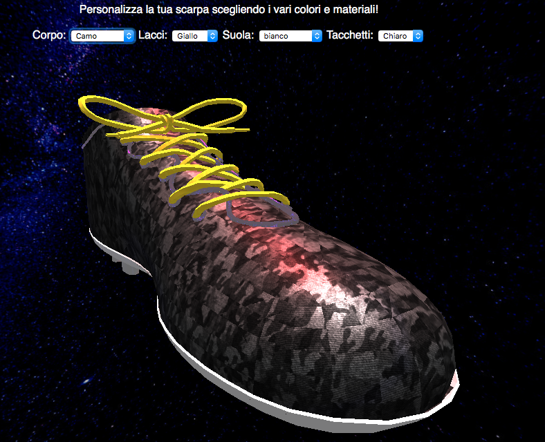

# Product-Visualization - Capolingua

## Report

E' stata realizzato un sito della compagnia ACME per la vendita di una scarpa da calcio. Questo offre la possibilità di modificare a piacere la scarpa cambiandone colori e materiali.

Per poter riprodurre correttamente il progetto è necessario eseguirlo in locale. Per farlo ho usato XAMPP. Vedere documentazione THREE.js per ulteriori chiarimenti.

##Implementazione
Il modello della scarpa è stato esportato in glTF. Per la gestione degli shader e dei materiali è stato utilizzato il MeshPhysicalMaterial di threejs.
Questo viene usato per applicare un materiale PBR per aumentare i dettagli e la fedeltà della scena.
In dettaglio la brdf viene definita attraverso il modello delle microsfaccettature, questo sfrutta la componente lambertiana per calcolare il valore diffuso

indicando con:

- l vettore luce
- v vettore view
- h normale della microsuperficie

Il valore speculare viene calcoalato sfruttando la distrubuzione delle microfaccette viene implementata attraverso il modello Generalized-Trowbridge-Reitz (GTR).

Per il valore speculare F viene usata l'approssimazione di Fresnel Shilick implementata come visto a lezione, FSchlick = F0 + (1 − F0)(1 − cos θd)^5.

La funzione geometrica viene implementata sfruttando l'approssimazione di Smith vista a lezione G(l,v,h)=G1(l)G1(v)

Nella scena sono presenti una ambient light, una directional light e una point light

## Materiali

Vengono usati materiali con caratteristiche diverse per le varie parti del modello sia con texture PBR che solo colori ognuno con diversi valori di roughness e metalness.

- CAMO texture effetto camo
- Lether texture effetto pelle
- Yellow texture gialla
- Nero lucido colore nero riflettente
- Denim texture effetto jeans

## Credits

- Modello @Microsoft
- Textures @3dtextures.me
- CubeMap @Threejs example cubemap
- index template @pixelarity

## Risultato

